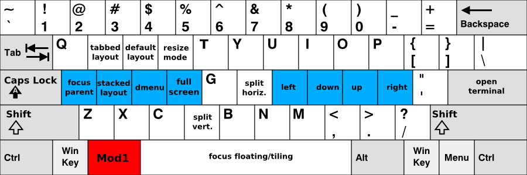
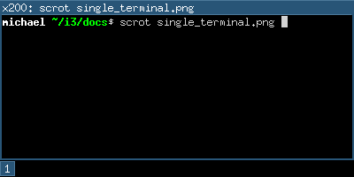
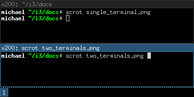
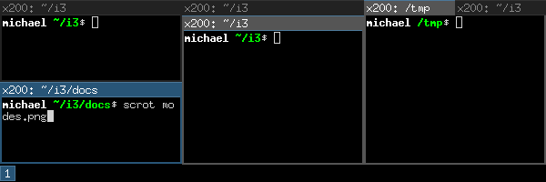
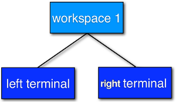
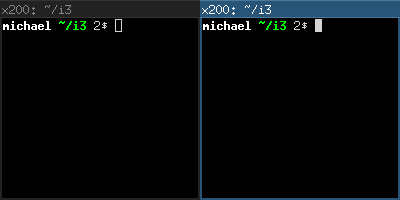
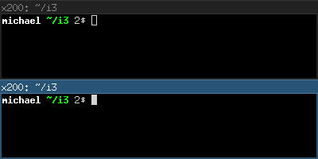
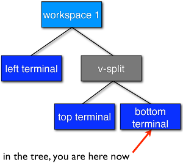
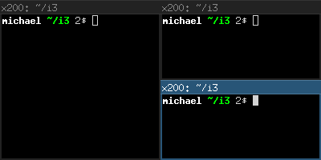
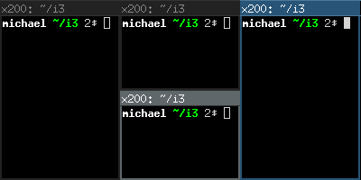

# Guía del Usuario de i3
Michael Stapelberg  
michael@i3wm.org

Este documento contiene toda la información que necesitas para configurar y usar el gestor de ventanas i3. Si no es así, puedes [contactarnos](https://i3wm.org/contact/) en [GitHub Discussions](https://github.com/i3/i3/discussions), IRC o la lista de correo.

## 1. Combinaciones de teclas predeterminadas
Para aquellos que prefieren una versión breve, aquí hay una visión general de las combinaciones de teclas predeterminadas (haz clic para ver la imagen en tamaño completo):

### Teclas para usar con $mod (Alt):


### Teclas para usar con Shift+$mod:


Las teclas rojas son los modificadores que necesitas presionar (por defecto), las teclas azules son tu fila de inicio.

Ten en cuenta que, al iniciar i3 sin un archivo de configuración, i3-config-wizard te ofrecerá crear un archivo de configuración en el que las posiciones de las teclas (!) coinciden con lo que ves en la imagen anterior, independientemente del diseño del teclado que estés utilizando. Si prefieres usar un archivo de configuración donde las letras de las teclas coincidan con lo que ves arriba, simplemente rechaza la oferta de i3-config-wizard y basa tu configuración en `/etc/i3/config`.

## 2. Usando i3
A lo largo de esta guía, la palabra clave `$mod` se usará para referirse al modificador configurado. Esta es la tecla Alt (`Mod1`) por defecto, con la tecla Windows (`Mod4`) siendo una alternativa popular que previene en gran medida los conflictos con los atajos definidos por las aplicaciones.

### 2.1. Abriendo terminales y moviéndose
Una operación muy básica es abrir una nueva terminal. Por defecto, la combinación de teclas para esto es `$mod+Enter`, es decir, Alt+Enter (`Mod1+Enter`) en la configuración predeterminada. Al presionar `$mod+Enter`, se abrirá una nueva terminal. Esta llenará todo el espacio disponible en tu pantalla.



Si ahora abres otra terminal, i3 la colocará junto a la actual, dividiendo el tamaño de la pantalla a la mitad. Dependiendo de tu monitor, i3 pondrá la ventana creada al lado de la ventana existente (en pantallas anchas) o debajo de la ventana existente (pantallas rotadas).



Para mover el foco entre las dos terminales, puedes usar las teclas de flecha. Para mayor comodidad, las flechas también están disponibles directamente en la fila de inicio del teclado debajo de tu mano derecha:

|  |  | 
|--------------|--------------|
| `$mod+j` | izquierda |
| `$mod+k` | abajo |
| `$mod+l` | arriba |
| `$mod+;` | derecha |

Ten en cuenta que esto difiere en una tecla del popular editor de texto `vi`, que fue [desarrollado en un terminal ADM-3A y por lo tanto usa hjkl en lugar de jkl;](https://twitter.com/hillelogram/status/1326600125569961991) — el valor predeterminado de i3 está diseñado para requerir un movimiento mínimo de los dedos, pero algunos usuarios de `vi` cambian su configuración de i3 por consistencia.

En este momento, tu espacio de trabajo está dividido (contiene dos terminales) en una dirección específica (horizontal por defecto). Cada ventana puede dividirse horizontal o verticalmente nuevamente, al igual que el espacio de trabajo. La terminología es "ventana" para un contenedor que contiene una ventana X11 (como un terminal o navegador) y "contenedor dividido" para los contenedores que consisten en una o más ventanas.

Para dividir una ventana verticalmente, presiona `$mod+v` antes de crear la nueva ventana. Para dividirla horizontalmente, presiona `$mod+h`.

### 2.2. Cambiando el diseño del contenedor
Un contenedor dividido puede tener uno de los siguientes diseños:

`splith/splitv`  
Las ventanas se dimensionan de manera que cada ventana obtenga una cantidad igual de espacio en el contenedor. `splith` distribuye las ventanas horizontalmente (las ventanas están una al lado de la otra), `splitv` las distribuye verticalmente (las ventanas están una encima de la otra).

`stacking`  
Solo se muestra la ventana enfocada en el contenedor. Obtienes una lista de ventanas en la parte superior del contenedor.

`tabbed`  
El mismo principio que `stacking`, pero la lista de ventanas en la parte superior es solo una línea que está dividida verticalmente.

Para cambiar de modo, presiona `$mod+e` para splith/splitv (alternará entre ambos), `$mod+s` para stacking y `$mod+w` para tabbed.



### 2.3. Alternar el modo de pantalla completa para una ventana

Para mostrar una ventana en modo de pantalla completa o salir del modo de pantalla completa, presiona `$mod+f`.

También hay un modo de pantalla completa global en i3 en el cual el cliente abarcará todas las salidas disponibles (el comando es `fullscreen toggle global`).

### 2.4. Abrir otras aplicaciones

Además de abrir aplicaciones desde una terminal, también puedes usar el práctico `dmenu`, que se abre presionando `$mod+d` por defecto. Solo escribe el nombre (o una parte de él) de la aplicación que deseas abrir. La aplicación correspondiente debe estar en tu `$PATH` para que esto funcione.

TODO: configuración es un link  
Además, si tienes aplicaciones que abres muy frecuentemente, puedes crear una combinación de teclas para iniciar la aplicación directamente. Consulta la sección [configuración] para más detalles.

### 2.5. Cerrar ventanas

Si una aplicación no proporciona un mecanismo para cerrar (la mayoría de las aplicaciones proporcionan un menú, la tecla Escape o un atajo como `Control+w` para cerrar), puedes presionar `$mod+Shift+q` para matar una ventana. Para las aplicaciones que soportan el protocolo WM_DELETE, esto cerrará correctamente la aplicación (guardando cualquier modificación o realizando otra limpieza). Si la aplicación no soporta el protocolo WM_DELETE, tu servidor X matará la ventana y el comportamiento dependerá de la aplicación.

### 2.6. Uso de espacios de trabajo

Los espacios de trabajo son una forma fácil de agrupar un conjunto de ventanas. Por defecto, estás en el primer espacio de trabajo, como indica la barra en la parte inferior izquierda. Para cambiar a otro espacio de trabajo, presiona `$mod+num`, donde `num` es el número del espacio de trabajo que deseas usar. Si el espacio de trabajo no existe todavía, se creará.

Un paradigma común es poner el navegador web en un espacio de trabajo, las aplicaciones de comunicación (`mutt`, `irssi`, ...) en otro, y las que usas para trabajar, en un tercero. Por supuesto, no hay necesidad de seguir este enfoque.

Si tienes múltiples pantallas, se creará un espacio de trabajo en cada pantalla al iniciar. Si abres un nuevo espacio de trabajo, estará vinculado a la pantalla en la que lo creaste. Cuando cambies a un espacio de trabajo en otra pantalla, i3 enfocará esa pantalla.

### 2.7. Mover ventanas a espacios de trabajo

Para mover una ventana a otro espacio de trabajo, simplemente presiona `$mod+Shift+num`, donde `num` es (al igual que al cambiar de espacios de trabajo) el número del espacio de trabajo de destino. De manera similar a cambiar de espacios de trabajo, el espacio de trabajo de destino se creará si aún no existe.

### 2.8. Redimensionar

La forma más fácil de redimensionar un contenedor es usando el mouse: agarra el borde y muévelo al tamaño deseado.

TODO: binding_modes, configuración predeterminada=default_config

También puedes usar [binding_modes] para definir un modo de redimensionamiento a través del teclado. Para ver un ejemplo de esto, consulta la configuración predeterminada proporcionada por i3.

### 2.9. Reiniciar i3 en el lugar

Para reiniciar i3 en el lugar (y así entrar en un estado limpio si hay un error, o para actualizar a una versión más reciente de i3), puedes usar `$mod+Shift+r`.

### 2.10. Reiniciar i3 en el lugar

Para salir de i3 de manera limpia sin matar tu servidor X, puedes usar `$mod+Shift+e`. Por defecto, aparecerá un diálogo preguntándote si realmente deseas salir.

### 2.11. Flotante

El modo flotante es el opuesto al modo en mosaico. La posición y el tamaño de una ventana no son gestionados automáticamente por i3, sino manualmente por ti. Usar este modo viola el paradigma de mosaico, pero puede ser útil para algunos casos excepcionales como las ventanas de diálogo "Guardar como" o ventanas de herramientas (GIMP o similar). Esas ventanas usualmente establecen la pista apropiada y se abren en modo flotante por defecto.


TODO: floating_modifier, configuración predeterminada

Puedes alternar el modo flotante para una ventana presionando `$mod+Shift+Space`. Arrastrando la barra de título de la ventana con tu mouse puedes mover la ventana. Agarrando los bordes y moviéndolos puedes redimensionar la ventana. También puedes hacerlo usando el [floating_modifier]. Otra forma de redimensionar ventanas flotantes usando el mouse es hacer clic derecho en la barra de título y arrastrar.

Para redimensionar ventanas flotantes con tu teclado, consulta el modo de combinación de teclas de redimensionamiento proporcionado por la configuración predeterminada de i3.

Las ventanas flotantes siempre están sobre las ventanas en mosaico.
 
TODO:

### 2.12. Mover contenedores en mosaico con el mouse

Desde i3 4.21, es posible arrastrar contenedores en mosaico usando el mouse. El arrastre puede iniciarse arrastrando la barra de título de la ventana o presionando el [floating_modifier] y arrastrando el contenedor mientras mantienes presionado el botón izquierdo del mouse. Consulta la opción [config_tiling_drag] para configurar qué acción desencadena el arrastre en mosaico.

Una vez que se inicia el arrastre y el cursor ha dejado el contenedor original, se crean indicadores de caída según la posición del cursor en relación con el contenedor objetivo. Estos indicadores te ayudan a entender cómo será el diseño del [árbol] resultante después de soltar el botón del mouse.

Las posiciones posibles de caída son:

#### Caída sobre el contenedor
Esto ocurre cuando el mouse está relativamente cerca del centro de un contenedor. Si se suelta el mouse, el resultado es exactamente como si hubieras ejecutado el comando `move container to mark`. Consulta [move_to_mark].

#### Caída como hermano
Esto ocurre cuando el mouse está relativamente cerca del borde de un contenedor. Si se suelta el mouse, el contenedor arrastrado se convertirá en un hermano del contenedor objetivo, colocado a la izquierda/derecha/arriba/abajo según la posición del indicador. Esto puede o no crear una nueva división vertical (v-split) o horizontal (h-split) según el diseño previo del contenedor objetivo. Por ejemplo, si el contenedor objetivo está en una división horizontal (h-split) y sueltas el contenedor arrastrado debajo de él, el nuevo diseño tendrá que ser una división vertical (v-split).

#### Caída al contenedor padre
Esto ocurre cuando el mouse está relativamente cerca del borde de un contenedor (pero aún más cerca del borde en comparación con el caso de hermano) y si ese borde también es el borde del contenedor padre. Por ejemplo, si tres contenedores están en un diseño horizontal, los bordes donde esto puede ocurrir son el borde izquierdo del contenedor izquierdo, el borde derecho del contenedor derecho y todos los bordes inferiores y superiores de los tres contenedores. Si se suelta el mouse, el contenedor primero se deja caer como un hermano del contenedor objetivo, como en el caso anterior, y luego se mueve direccionalmente como con el comando `move left|right|down|up`. Consulta [move_direction].

El color del indicador coincide con la configuración de `client.focused`. Consulta [client_colors].

## 3. Árbol

i3 almacena toda la información sobre las salidas X11, los espacios de trabajo y la disposición de las ventanas en ellos en un árbol. El nodo raíz es la ventana raíz de X11, seguido por las salidas X11, luego las áreas de acoplamiento y un contenedor de contenido, luego los espacios de trabajo y finalmente las ventanas en sí. En versiones anteriores de i3, teníamos múltiples listas (de salidas, espacios de trabajo) y una tabla para cada espacio de trabajo. Ese enfoque resultó ser complicado de usar (ajuste), entender e implementar.

### 3.1. El árbol consiste en Contenedores

Los bloques de construcción de nuestro árbol son los llamados `Contenedores`. Un `Contenedor` puede alojar una ventana (es decir, una ventana X11, una que realmente puedes ver y usar, como un navegador). Alternativamente, podría contener uno o más `Contenedores`. Un ejemplo simple es el espacio de trabajo: cuando inicias i3 con un solo monitor, un solo espacio de trabajo y abres dos ventanas de terminal, terminarás con un árbol como este:





Figura 1. Dos terminales en un espacio de trabajo estándar.

### 3.2. Orientación y Contenedores Divididos

Es natural usar los llamados `Contenedores Divididos` para construir un diseño cuando se utiliza un árbol como estructura de datos. En i3, cada `Contenedor` tiene una orientación (horizontal, vertical o no especificada) y la orientación depende del diseño en el que se encuentre el contenedor (vertical para splitv y stacking, horizontal para splith y tabbed). Así que, en nuestro ejemplo con el espacio de trabajo, el diseño predeterminado del `Contenedor` del espacio de trabajo es splith (la mayoría de los monitores son panorámicos hoy en día). Si cambias el diseño a splitv (`$mod+v` en la configuración predeterminada) y luego abres dos terminales, i3 configurará tus ventanas de esta manera:



Figura 2. Orientación Vertical del Espacio de Trabajo

Una característica interesante de i3 desde la versión 4 es la capacidad de dividir cualquier cosa: supongamos que tienes dos terminales en un espacio de trabajo (con el diseño splith, es decir, orientación horizontal), y el foco está en el terminal derecho. Ahora quieres abrir otra ventana de terminal debajo de la actual. Si simplemente abres una nueva ventana de terminal, aparecerá a la derecha debido al diseño splith. En su lugar, presiona `$mod+v` para dividir el contenedor con el diseño splitv (para abrir un `Contenedor de División Horizontal`, usa `$mod+h`). Ahora puedes abrir un nuevo terminal y se abrirá debajo del actual:





Figura 3. Contenedor de División Vertical

Probablemente ya lo adivinaste: no hay límite en la profundidad que puede tener tu jerarquía de divisiones.

### 3.3. Enfocar contenedor padre

Sigamos con nuestro ejemplo anterior. Tenemos un terminal a la izquierda y dos terminales divididos verticalmente a la derecha, y el foco está en el terminal inferior derecho. Cuando abres un nuevo terminal, se abrirá debajo del actual.

Entonces, ¿cómo puedes abrir una nueva ventana de terminal a la `derecha` de la actual? La solución es usar `enfocar contenedor padre`, lo que enfocará el `Contenedor Padre` del `Contenedor` actual. En la configuración predeterminada, usa `$mod+a` para navegar un `Contenedor` hacia arriba en el árbol (puedes repetir esto varias veces hasta llegar al `Contenedor del Espacio de Trabajo`). En este caso, enfocarías el `Contenedor de División Vertical` que está `dentro` del espacio de trabajo orientado horizontalmente. Así, las nuevas ventanas se abrirán a la derecha del `Contenedor de División Vertical`:



Figura 4. Enfocar contenedor padre, luego abrir un nuevo terminal

### 3.4. Contenedores implícitos

En algunos casos, i3 necesita crear implícitamente un contenedor para cumplir con tu comando.

Un ejemplo es el siguiente escenario: Inicias i3 con un solo monitor y un solo espacio de trabajo en el que abres tres ventanas de terminal. Todas estas ventanas de terminal están directamente conectadas a un nodo dentro del árbol de diseño de i3, el nodo del espacio de trabajo. Por defecto, la orientación del nodo del espacio de trabajo es `horizontal`.

Ahora mueves una de estas terminales hacia abajo (`$mod+Shift+k` por defecto). La orientación del nodo del espacio de trabajo se cambiará a `vertical`. La ventana de terminal que moviste hacia abajo está directamente conectada al espacio de trabajo y aparece en la parte inferior de la pantalla. Se creó un nuevo contenedor (horizontal) para acomodar las otras dos ventanas de terminal. Notarás esto al cambiar al modo de pestañas (por ejemplo). Terminarías teniendo una pestaña con una representación del contenedor dividido (por ejemplo, "H[urxvt firefox]") y la otra siendo la ventana de terminal que moviste hacia abajo.
 
## Configuración de i3

Aquí es donde comienza la verdadera diversión ;-). La mayoría de las cosas dependen mucho de tu entorno de trabajo ideal, por lo que no podemos establecer valores predeterminados razonables para ellas.

Aunque no se utiliza un lenguaje de programación para la configuración, i3 sigue siendo bastante flexible en cuanto a las cosas que normalmente quieres que haga tu gestor de ventanas.

Por ejemplo, puedes configurar combinaciones de teclas para saltar a ventanas específicas, puedes configurar aplicaciones específicas para que se inicien en espacios de trabajo específicos, puedes iniciar aplicaciones automáticamente, puedes cambiar los colores de i3 y puedes vincular tus teclas para hacer cosas útiles.

Para cambiar la configuración de i3, copia `/etc/i3/config` a `~/.i3/config` (o `~/.config/i3/config` si prefieres el esquema de directorios XDG) y edítalo con un editor de texto.

En el primer inicio (y en todos los inicios siguientes, a menos que tengas un archivo de configuración), i3 te ofrecerá crear un archivo de configuración. Puedes indicarle al asistente que use Alt (`Mod1`) o Windows (`Mod4`) como modificador en el archivo de configuración. Además, el archivo de configuración creado usará los símbolos de teclas de tu diseño de teclado actual. Para iniciar el asistente, usa el comando `i3-config-wizard`. Ten en cuenta que no debes tener `~/.i3/config`, de lo contrario, el asistente se cerrará.

Desde i3 4.0, se utiliza un nuevo formato de configuración. i3 intentará detectar automáticamente la versión del formato de un archivo de configuración basado en algunas palabras clave diferentes, pero si quieres asegurarte de que tu configuración se lea con el nuevo formato, incluye la siguiente línea en tu archivo de configuración:

```bash
# i3 config file (v4)
```

### 4.1. Directiva de inclusión

Desde i3 v4.20, es posible incluir otros archivos de configuración desde tu configuración de i3.

Sintaxis:

```bash
include <pattern>
```

TODO

i3 expande el patrón utilizando una expansión de palabras similar a la del shell, específicamente usando la función de la biblioteca estándar de C wordexp(3).

Ejemplos:

```bash
# Tilde expands to the user’s home directory:
include ~/.config/i3/assignments.conf

# Environment variables are expanded:
include $HOME/.config/i3/assignments.conf

# Wildcards are expanded:
include ~/.config/i3/config.d/*.conf

# Command substitution:
include ~/.config/i3/`hostname`.conf

# i3 loads each path only once, so including the i3 config will not result
# in an endless loop, but in an error:
include ~/.config/i3/config

# i3 changes the working directory while parsing a config file
# so that relative paths are interpreted relative to the directory
# of the config file that contains the path:
include assignments.conf
```

Si un archivo especificado no puede ser leído, por ejemplo, debido a la falta de permisos de archivo o porque es un enlace simbólico roto, i3 informará un error y continuará procesando el resto de tu configuración.

Para listar todos los archivos de configuración cargados, ejecuta i3 --moreversion:

```bash
% i3 --moreversion
Binary i3 version:  4.19.2-87-gfcae64f7+ © 2009 Michael Stapelberg and contributors
Running i3 version: 4.19.2-87-gfcae64f7+ (pid 963940)
Loaded i3 config:
  /tmp/i3.cfg (main) (last modified: 2021-05-13T16:42:31 CEST, 463 seconds ago)
  /tmp/included.cfg (included) (last modified: 2021-05-13T16:42:43 CEST, 451 seconds ago)
  /tmp/another.cfg (included) (last modified: 2021-05-13T16:42:46 CEST, 448 seconds ago)
```

Las variables se comparten entre todos los archivos de configuración, pero ten en cuenta la siguiente limitación:

- Puedes definir una variable y usarla dentro de un archivo incluido.
  
- No puedes usar (en el archivo principal) una variable que se haya definido dentro de un archivo incluido.

Esta es una limitación técnica: la expansión de variables ocurre en una etapa separada antes de analizar las directivas de inclusión.

Conceptualmente, los archivos incluidos solo pueden añadir a la configuración, no deshacer los efectos de la configuración ya procesada. Por ejemplo, solo puedes añadir nuevas combinaciones de teclas, no sobrescribir o eliminar combinaciones de teclas existentes. Esto significa:

- La directiva `include` es adecuada para organizar configuraciones grandes en archivos separados, posiblemente seleccionando archivos basados en condiciones.

- La directiva `include` no es adecuada para expresar "usar la configuración predeterminada con los siguientes cambios". Para ese caso, aún recomendamos copiar y modificar la configuración predeterminada.

Nota:  
> En términos de implementación, i3 actualmente no construye una gran configuración a partir de todas las directivas `include`. En su lugar, el analizador de archivos de configuración de i3 interpreta todas las directivas de configuración en su función `parse_file()`. Al procesar una directiva de configuración `include`, el analizador llama recursivamente a `parse_file()`. 
Esto significa que el orden de evaluación de los archivos forma un árbol, o se podría decir que i3 utiliza un recorrido en profundidad (depth-first traversal).

### 4.2. Comentarios
Es posible y recomendable usar comentarios en tu archivo de configuración para documentar adecuadamente tu configuración para referencia futura. Los comentarios comienzan con un # y solo pueden usarse al principio de una línea:

Ejemplos:

```bash
# This is a comment
```


### 4.3. Fuentes
i3 tiene soporte tanto para fuentes X core como para fuentes FreeType (a través de Pango) para renderizar los títulos de las ventanas.

Para generar una descripción de una fuente X core, puedes usar `xfontsel(1)`. Para ver caracteres especiales (Unicode), necesitas usar una fuente que soporte la codificación ISO-10646.

Una descripción de fuente FreeType se compone de una familia de fuentes, un estilo, un peso, una variante, una expansión y un tamaño. Las fuentes FreeType soportan renderizado de derecha a izquierda y a menudo contienen más glifos Unicode que las fuentes X core.

Si i3 no puede abrir la fuente configurada, emitirá un error en el archivo de registro y volverá a una fuente funcional.

Sintaxis:

```bash
font <X core font description>
font pango:<family list> [<style options>] <size>
```

Ejemplos:

```bash
font -misc-fixed-medium-r-normal--13-120-75-75-C-70-iso10646-1
font pango:DejaVu Sans Mono 10
font pango:DejaVu Sans Mono, Terminus Bold Semi-Condensed 11
font pango:Terminus 11px
```

### 4.4. Combinaciones de teclas
Una combinación de teclas hace que i3 ejecute un comando (ver más abajo) al presionar una tecla específica. i3 te permite vincular ya sea en códigos de teclas o en keysyms (también puedes mezclar tus combinaciones, aunque i3 no te protegerá de las superposiciones).

- Un keysym (símbolo de tecla) es una descripción para un símbolo específico, como "a" o "b", pero también algunos más extraños como "underscore" en lugar de "_". Estos son los que usas en Xmodmap para reasignar tus teclas. Para obtener la asignación actual de tus teclas, usa `xmodmap -pke`. Para ingresar interactivamente una tecla y ver a qué keysym está configurada, usa `xev`.

- Los códigos de teclas no necesitan tener un símbolo asignado (útil para teclas de acceso rápido de proveedores personalizados en algunos portátiles) y no cambiarán su significado al cambiar a un diseño de teclado diferente (cuando se usa `xmodmap`).

Mi recomendación es: si cambias de diseño de teclado con frecuencia pero quieres mantener tus combinaciones en la misma ubicación física en el teclado, usa códigos de teclas. Si no cambias de diseño y quieres un archivo de configuración limpio y simple, usa keysyms.

Algunas herramientas (como `import` o `xdotool`) pueden no ser capaces de ejecutarse al producirse un evento KeyPress, porque el teclado/puntero todavía está capturado. Para estas situaciones, se puede usar la bandera `--release`, que ejecutará el comando después de que se hayan liberado las teclas.

Sintaxis:

```bash
bindsym [--release] [<Group>+][<Modifiers>+]<keysym> command
bindcode [--release] [<Group>+][<Modifiers>+]<keycode> command
```

Ejemplos:

```bash
# Fullscreen
bindsym $mod+f fullscreen toggle

# Restart
bindsym $mod+Shift+r restart

# Notebook-specific hotkeys
bindcode 214 exec --no-startup-id /home/michael/toggle_beamer.sh

# Simulate ctrl+v upon pressing $mod+x
bindsym --release $mod+x exec --no-startup-id xdotool key --clearmodifiers ctrl+v

# Take a screenshot upon pressing $mod+x (select an area)
bindsym --release $mod+x exec --no-startup-id import /tmp/latest-screenshot.png
```

Modificadores disponibles:

`Mod1-Mod5, Shift, Control`  
Modificadores estándar, ver `xmodmap(1)`

`Group1, Group2, Group3, Group4`  
Cuando se usan múltiples diseños de teclado (por ejemplo, con `setxkbmap -layout us,ru`), puedes especificar en qué grupo XKB (también llamado "layout") debería estar activa una combinación de teclas. Por defecto, las combinaciones de teclas se traducen en Group1 y están activas en todos los grupos. Si deseas sobrescribir combinaciones de teclas en uno de tus diseños, especifica el grupo correspondiente. Para compatibilidad con versiones anteriores, el grupo "Mode_switch" es un alias para Group2.

TODO

### 4.5. Combinaciones de ratón

Una combinación de ratón hace que i3 ejecute un comando al presionar un botón específico del ratón en el ámbito del contenedor clicado (ver [command_criteria]). Puedes configurar combinaciones de ratón de manera similar a las combinaciones de teclas.

Sintaxis:

```bash
bindsym [--release] [--border] [--whole-window] [--exclude-titlebar] [<Modifiers>+]button<n> command
```

De forma predeterminada, la combinación solo se ejecutará cuando hagas clic en la barra de título de la ventana. Si se proporciona la bandera `--release`, se ejecutará cuando se suelte el botón del ratón.

Si se proporciona la bandera `--whole-window`, la combinación también se ejecutará cuando se haga clic en cualquier parte de la ventana, con excepción del borde. Para que una combinación se ejecute al hacer clic en el borde, especifica la bandera `--border`.

Si se proporciona la bandera `--exclude-titlebar`, la barra de título no se considerará para la combinación de teclas.

Ejemplos:

```bash
# The middle button over a titlebar kills the window
bindsym --release button2 kill

# The middle button and a modifier over any part of the window kills the window
bindsym --whole-window $mod+button2 kill

# The right button toggles floating
bindsym button3 floating toggle
bindsym $mod+button3 floating toggle

# The side buttons move the window around
bindsym button9 move left
bindsym button8 move right
```

TODO

### 4.6. Modos de combinación de teclas

Puedes tener múltiples conjuntos de combinaciones de teclas usando diferentes modos de combinación. Cuando cambias a otro modo de combinación, todas las combinaciones del modo actual se liberan y solo las combinaciones definidas en el nuevo modo son válidas mientras permanezcas en ese modo de combinación. El único modo de combinación predefinido es el predeterminado, que es el modo con el que i3 inicia y al que pertenecen todas las combinaciones no definidas en un modo de combinación específico.

Trabajar con modos de combinación consta de dos partes: definir un modo de combinación y cambiar a él. Para estos propósitos, hay una directiva de configuración y un comando, ambos llamados `mode`. La directiva se usa para definir las combinaciones pertenecientes a un cierto modo de combinación, mientras que el comando cambiará al modo especificado.

Se recomienda usar modos de combinación en combinación con [variables] para facilitar el mantenimiento. A continuación, se muestra un ejemplo de cómo usar un modo de combinación.

Ten en cuenta que es aconsejable definir combinaciones para cambiar de nuevo al modo predeterminado.

Ten en cuenta que es posible usar [pango_markup] para los modos de combinación, pero necesitas habilitarlo explícitamente pasando la bandera `--pango_markup` a la definición del modo.

Sintaxis:

```bash
# config directive
mode [--pango_markup] <name>

# command
mode <name>
```

Ejemplo:

```bash
# Press $mod+o followed by either f, t, Escape or Return to launch firefox,
# thunderbird or return to the default mode, respectively.
set $mode_launcher Launch: [f]irefox [t]hunderbird
bindsym $mod+o mode "$mode_launcher"

mode "$mode_launcher" {
    bindsym f exec firefox
    bindsym t exec thunderbird

    bindsym Escape mode "default"
    bindsym Return mode "default"
}
```

### 4.7. El modificador flotante
Para mover ventanas flotantes con tu mouse, puedes agarrar su barra de título o configurar el llamado modificador flotante que puedes presionar y hacer clic en cualquier parte de la ventana para moverla. La configuración más común es usar la misma tecla que usas para gestionar ventanas (por ejemplo, Mod1). Entonces, puedes presionar Mod1, hacer clic en una ventana con el botón izquierdo del mouse y arrastrarla a la posición que desees.

Al mantener presionado el modificador flotante, puedes redimensionar una ventana flotante presionando el botón derecho del mouse sobre ella y moviéndola mientras lo mantienes presionado. Si también mantienes presionada la tecla Shift, el redimensionamiento será proporcional (se conservará la relación de aspecto).

Sintaxis:

```bash
floating_modifier <Modifier>
```

Ejemplo:

```bash
floating_modifier Mod1
```

### 4.8. Restringir el tamaño de las ventanas flotantes
Se pueden especificar las dimensiones máximas y mínimas de las ventanas flotantes. Si alguna dimensión de `floating_maximum_size` se especifica como -1, esa dimensión no estará restringida con respecto a su valor máximo. Si alguna dimensión de `floating_maximum_size` no está definida o se especifica como 0, i3 usará un valor predeterminado para restringir el tamaño máximo. `floating_minimum_size` se trata de manera análoga a `floating_maximum_size`.

Sintaxis:

```bash
floating_minimum_size <width> x <height>
floating_maximum_size <width> x <height>
```

Ejemplo:

```bash
floating_minimum_size 75 x 50
floating_maximum_size -1 x -1
```

### 4.9. Orientación para nuevos espacios de trabajo
Los nuevos espacios de trabajo obtienen una orientación predeterminada razonable: los monitores panorámicos (cualquier monitor más ancho que alto) obtienen orientación horizontal, los monitores rotados (cualquier monitor más alto que ancho) obtienen orientación vertical.

Con la directiva de configuración `default_orientation`, puedes anular ese comportamiento.

Sintaxis:

```bash
default_orientation horizontal|vertical|auto
```

Ejemplo:

```bash
default_orientation vertical
```

### 4.10. Modo de diseño para nuevos contenedores
Esta opción determina en qué modo comenzarán los nuevos contenedores a nivel de espacio de trabajo.

Sintaxis:

```bash
workspace_layout default|stacking|tabbed
```

Ejemplo:

```bash
workspace_layout tabbed
```

### 4.11. Alineación del título de la ventana

Esta opción determina la alineación del texto del título de la ventana. El valor predeterminado es izquierda.

Sintaxis:

```bash
title_align left|center|right
```

### 4.12. Estilo de borde predeterminado para nuevas ventanas
Esta opción determina qué estilo de borde tendrán las nuevas ventanas. El valor predeterminado es `normal`. Ten en cuenta que default_floating_border se aplica solo a las ventanas que comienzan como ventanas flotantes, por ejemplo, ventanas de diálogo, pero no a las ventanas que se flotan más tarde.

Establecer el estilo de borde en `pixel` elimina las barras de título en diseños divididos. El estilo de borde `normal` te permite ajustar el ancho del borde mientras mantienes la barra de título.

La barra de título siempre es visible en los diseños stacking y tabbed, y esto no se puede cambiar a través de la configuración.

Sintaxis:

```bash
default_border normal|none|pixel
default_border normal|pixel <px>
default_floating_border normal|none|pixel
default_floating_border normal|pixel <px>
```

Ten en cuenta que `new_window` y `new_float` han sido desaprobados en favor de las opciones anteriores y serán eliminados en una futura versión. Recomendamos encarecidamente usar las nuevas opciones en su lugar.

Ejemplo:

```bash
default_border pixel
```

Los estilos de borde "normal" y "pixel" admiten un ancho de borde opcional en píxeles:

Ejemplo:

```bash
# The same as default_border none
default_border pixel 0

# A 3 px border
default_border pixel 3
```

### 4.13. Ocultar bordes adyacentes a los bordes de la pantalla

Puedes ocultar los bordes de los contenedores adyacentes a los bordes de la pantalla usando `hide_edge_borders` (el valor predeterminado es `none`). Ocultar los bordes es útil si estás usando barras de desplazamiento o no quieres desperdiciar ni siquiera dos píxeles de espacio en la pantalla.

La configuración "smart" oculta los bordes en los espacios de trabajo con solo una ventana visible, pero los mantiene en los espacios de trabajo con múltiples ventanas visibles.

La configuración "smart_no_gaps" oculta los bordes específicos de los bordes de un contenedor si el contenedor es el único contenedor en su espacio de trabajo y los márgenes hacia el borde de la pantalla son `0`.

`hide_edge_borders` ha reemplazado la antigua sintaxis `smart_borders`. Usa la primera en lugar de la segunda.

Sintaxis:

```bash
hide_edge_borders none|vertical|horizontal|both|smart|smart_no_gaps
```

Ejemplo:

```bash
hide_edge_borders vertical
```

### 4.14. Comandos arbitrarios para ventanas específicas (for_window)

Con la directiva `for_window`, puedes hacer que i3 ejecute cualquier comando cuando encuentre una ventana específica. Esto se puede usar para establecer ventanas en modo flotante o para cambiar su estilo de borde, por ejemplo.

Sintaxis:

```bash
for_window <criteria> <command>
```

Ejemplo:

```bash
# enable floating mode for all XTerm windows
for_window [class="XTerm"] floating enable

# Make all urxvts use a 1-pixel border:
for_window [class="urxvt"] border pixel 1

# A less useful, but rather funny example:
# makes the window floating as soon as I change
# directory to ~/work
for_window [title="x200: ~/work"] floating enable
```

TODO

Los criterios válidos son los mismos que para los comandos, consulta [command_criteria]. Solo los comandos pueden ejecutarse en tiempo de ejecución, no las directivas de configuración, consulta [list_of_commands].

### 4.15. No enfocar la ventana al abrirla

TODO

Cuando aparece una nueva ventana, se enfocará. La directiva `no_focus` permite evitar que esto suceda y debe usarse en combinación con [command_criteria].

Ten en cuenta que esto no se aplica a todos los casos, por ejemplo, cuando se alimentan datos a una aplicación en ejecución que hace que solicite ser enfocada. Para configurar el comportamiento en tales casos, consulta [focus_on_window_activation].

`no_focus` también será ignorado para la primera ventana en un espacio de trabajo, ya que no debería haber una razón para no enfocar la ventana en este caso. Esto permite una mejor usabilidad en combinación con `workspace_layout`.

Sintaxis:

```bash
no_focus <criteria>
```

Ejemplo:

```bash
no_focus [window_role="pop-up"]
```

### 4.16. Variables
Como aprendiste en la sección sobre combinaciones de teclas, tendrás que configurar muchas combinaciones que contienen teclas modificadoras. Si deseas ahorrarte algo de escritura y poder cambiar el modificador que usas más adelante, las variables pueden ser útiles.

Sintaxis:

```bash
set $<name> <value>
```

Ejemplo:

```bash
set $m Mod1
bindsym $m+Shift+r restart
```

TODO

Las variables se reemplazan directamente en el archivo durante el análisis. La expansión de variables no es recursiva, por lo que no es posible definir una variable con un valor que contenga otra variable. No hay un manejo especial y no hay absolutamente ningún plan para cambiar esto. Si necesitas una configuración más dinámica, deberías crear un pequeño script que genere un archivo de configuración y ejecutarlo antes de iniciar i3 (por ejemplo, en tu archivo `~/.xsession`).

Consulta también [xresources] para aprender cómo crear variables basadas en recursos cargados desde la base de datos de recursos de X.

TODO

### 4.17. Recursos de X

[variables] también se pueden crear usando un valor configurado en la base de datos de recursos de X. Esto es útil, por ejemplo, para evitar configurar valores de color dentro de la configuración de i3. En su lugar, los valores pueden configurarse una vez en la base de datos de recursos de X para lograr un tema de color coherente y fácil de mantener en muchas aplicaciones X.

Definir un recurso cargará este recurso desde la base de datos de recursos y asignará su valor a la variable especificada. Esto se hace literalmente y, por lo tanto, el valor debe estar en el formato que usa i3. Se debe especificar un valor de respaldo en caso de que el recurso no se pueda cargar desde la base de datos.

Sintaxis:

```bash
set_from_resource $<name> <resource_name> <fallback>
```

Ejemplo:

```bash
# The ~/.Xresources should contain a line such as
#     *color0: #121212
# and must be loaded properly, e.g., by using
#     xrdb ~/.Xresources
# This value is picked up on by other applications (e.g., the URxvt terminal
# emulator) and can be used in i3 like this:
set_from_resource $black i3wm.color0 #000000
```

TODO

### 4.18. Colocar automáticamente clientes en espacios de trabajo específicos

Para hacer que una ventana específica aparezca automáticamente en un espacio de trabajo específico, puedes usar una `asignación`. Puedes hacer coincidir ventanas usando cualquier criterio, consulta [command_criteria]. La diferencia entre assign y for_window <criteria> move to workspace es que la primera solo se ejecutará cuando la aplicación asigne la ventana (asignación significa realmente mostrarla en la pantalla) pero la segunda se ejecutará cada vez que una ventana cambie sus propiedades a algo que coincida con los criterios especificados.

Por lo tanto, se recomienda que coincidas con clases de ventana (y instancias, cuando sea apropiado) en lugar de títulos de ventana siempre que sea posible porque algunas aplicaciones primero crean su ventana y luego se preocupan por establecer el título correcto. Firefox con Vimperator viene a la mente. La ventana se inicia llamándose Firefox, y solo cuando Vimperator se carga cambia el título. Como i3 obtendrá el título tan pronto como la aplicación asigne la ventana, tendrías que hacer coincidir con Firefox en este caso. Otro problema conocido es con Spotify, que no establece los indicios de clase al asignar la ventana, lo que significa que tendrás que usar una regla `for_window` para asignar Spotify a un espacio de trabajo específico. Finalmente, usar `assign [tiling]` y `assign [floating]` no es compatible.

También puedes asignar una ventana para que aparezca en una salida específica. Puedes usar nombres de RandR como VGA1 o nombres relativos a la salida con el espacio de trabajo actualmente enfocado, como `left` y `down`.

Las asignaciones son procesadas por i3 en el orden en que aparecen en el archivo de configuración. La primera que coincide con la ventana gana y las asignaciones posteriores no se consideran.


Sintaxis:

```bash
assign <criteria> [→] [workspace] [number] <workspace>
assign <criteria> [→] output left|right|up|down|primary|nonprimary|<output>
```

Ejemplo:

```bash
# Assign URxvt terminals to workspace 2
assign [class="URxvt"] 2

# Same thing, but more precise (exact match instead of substring)
assign [class="^URxvt$"] 2

# Same thing, but with a beautiful arrow :)
assign [class="^URxvt$"] → 2

# Assignment to a named workspace
assign [class="^URxvt$"] → work

# Assign to the workspace with number 2, regardless of name
assign [class="^URxvt$"] → number 2

# You can also specify a number + name. If the workspace with number 2 exists,
# assign will skip the text part.
assign [class="^URxvt$"] → number "2: work"

# Start urxvt -name irssi
assign [class="^URxvt$" instance="^irssi$"] → 3

# Assign urxvt to the output right of the current one
assign [class="^URxvt$"] → output right

# Assign urxvt to the primary output
assign [class="^URxvt$"] → output primary

# Assign urxvt to the first non-primary output
assign [class="^URxvt$"] → output nonprimary
```