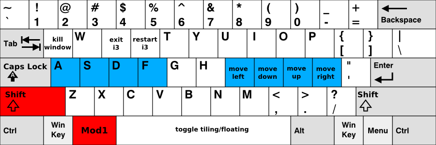

# Guía del Usuario de i3
Michael Stapelberg  
michael@i3wm.org

Este documento contiene toda la información que necesitas para configurar y usar el gestor de ventanas i3. Si no es así, puedes [contactarnos](https://i3wm.org/contact/) en [GitHub Discussions](https://github.com/i3/i3/discussions), IRC o la lista de correo.

## 1. Combinaciones de teclas predeterminadas
Para aquellos que prefieren una versión breve, aquí hay una visión general de las combinaciones de teclas predeterminadas (haz clic para ver la imagen en tamaño completo):

### Teclas para usar con $mod (Alt):

### Teclas para usar con Shift+$mod:

Las teclas rojas son los modificadores que necesitas presionar (por defecto), las teclas azules son tu fila de inicio.

Ten en cuenta que, al iniciar i3 sin un archivo de configuración, i3-config-wizard te ofrecerá crear un archivo de configuración en el que las posiciones de las teclas (!) coinciden con lo que ves en la imagen anterior, independientemente del diseño del teclado que estés utilizando. Si prefieres usar un archivo de configuración donde las letras de las teclas coincidan con lo que ves arriba, simplemente rechaza la oferta de i3-config-wizard y basa tu configuración en `/etc/i3/config`.

## 2. Usando i3
A lo largo de esta guía, la palabra clave `$mod` se usará para referirse al modificador configurado. Esta es la tecla Alt (`Mod1`) por defecto, con la tecla Windows (`Mod4`) siendo una alternativa popular que previene en gran medida los conflictos con los atajos definidos por las aplicaciones.

### 2.1 Abriendo terminales y moviéndose
Una operación muy básica es abrir una nueva terminal. Por defecto, la combinación de teclas para esto es `$mod+Enter`, es decir, Alt+Enter (`Mod1+Enter`) en la configuración predeterminada. Al presionar `$mod+Enter`, se abrirá una nueva terminal. Esta llenará todo el espacio disponible en tu pantalla.

Si ahora abres otra terminal, i3 la colocará junto a la actual, dividiendo el tamaño de la pantalla a la mitad. Dependiendo de tu monitor, i3 pondrá la ventana creada al lado de la ventana existente (en pantallas anchas) o debajo de la ventana existente (pantallas rotadas).

Para mover el foco entre las dos terminales, puedes usar las teclas de flecha. Para mayor comodidad, las flechas también están disponibles directamente en la fila de inicio del teclado debajo de tu mano derecha:

|  |  | 
|--------------|--------------|
| `$mod+j` | izquierda |
| `$mod+k` | abajo |
| `$mod+l` | arriba |
| `$mod+;` | derecha |

Ten en cuenta que esto difiere en una tecla del popular editor de texto `vi`, que fue [desarrollado en un terminal ADM-3A y por lo tanto usa hjkl en lugar de jkl;](https://twitter.com/hillelogram/status/1326600125569961991) — el valor predeterminado de i3 está diseñado para requerir un movimiento mínimo de los dedos, pero algunos usuarios de `vi` cambian su configuración de i3 por consistencia.

En este momento, tu espacio de trabajo está dividido (contiene dos terminales) en una dirección específica (horizontal por defecto). Cada ventana puede dividirse horizontal o verticalmente nuevamente, al igual que el espacio de trabajo. La terminología es "ventana" para un contenedor que contiene una ventana X11 (como un terminal o navegador) y "contenedor dividido" para los contenedores que consisten en una o más ventanas.

Para dividir una ventana verticalmente, presiona `$mod+v` antes de crear la nueva ventana. Para dividirla horizontalmente, presiona `$mod+h`.

### 2.2. Cambiando el diseño del contenedor
Un contenedor dividido puede tener uno de los siguientes diseños:

`splith/splitv`  
Las ventanas se dimensionan de manera que cada ventana obtenga una cantidad igual de espacio en el contenedor. `splith` distribuye las ventanas horizontalmente (las ventanas están una al lado de la otra), `splitv` las distribuye verticalmente (las ventanas están una encima de la otra).

`stacking`  
Solo se muestra la ventana enfocada en el contenedor. Obtienes una lista de ventanas en la parte superior del contenedor.

`tabbed`  
El mismo principio que stacking, pero la lista de ventanas en la parte superior es solo una línea que está dividida verticalmente.

Para cambiar de modo, presiona `$mod+e` para `splith/splitv` (alternará entre ambos), `$mod+s` para stacking y `$mod+w` para tabbed.